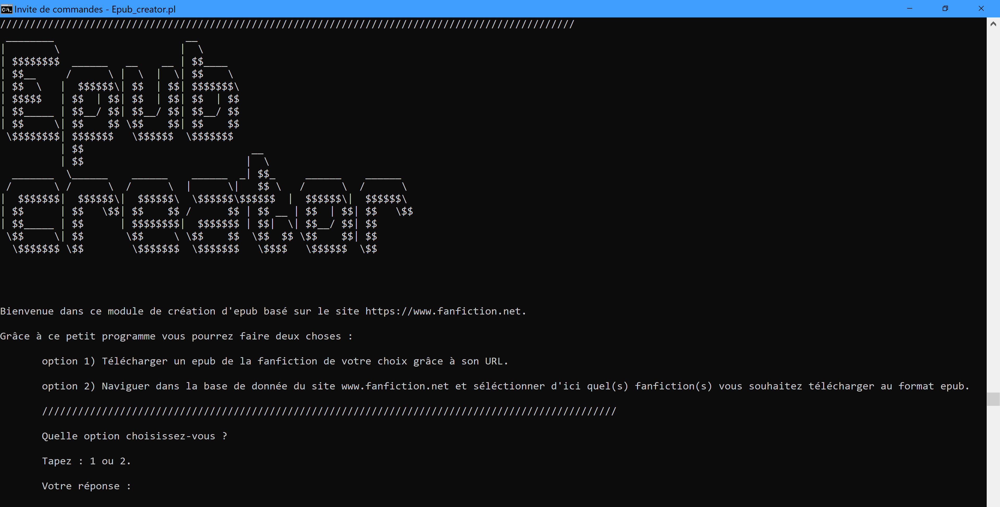

# Epub_creator

Ce programme écrit en perl assure deux fonctions :

    1) Télécharger une fanfiction depuis le site [www.fanfiction.net](www.fanfiction.net) 
    directement au format epub depuis l'URL de la fanfiction de votre choix.

    2) Parcourir au travers d'une série de questions les critères de sélections
    des fanfictions disponibles sur le site [www.fanfiction.net](www.fanfiction.net) et télécharger
    la ou les fanfictions correspondant aux choix de l'utilisateur.

Ce programme s'utilise depuis l'invite de commande.

## Bien démarrer

Télécharger ce projet github dans son ensemble et/ou dézipper l'archive dans un dossier de votre choix. 
Attention, tous les éléments de l'archive : Epub_creator.pl, navigation.pm, mise_en_page.pm et module_epub.pm 
doivent être dans le même dossier pour que le programme puisse fonctionner.   

### Prérequis

Il est nécessaire de télécharger un module supplémentaire pour faire fonctionner ce programme.
Le [module LWP::Simple](https://metacpan.org/pod/LWP::Simple) est disponible depuis le site web [metacpan](www.metacpan.org).


Pour télécharger le module LWP::Simple suivez les étapes suivantes.

Sur Windows : ouvrez l'invite de commande 
(depuis la barre de cherche en bas à gauche tapez cmd et cliquer sur l'application Invite de commande).

Ecrivez sur l'invite de commande la ligne suivante :

```
cpan install LWP::Simple
```
Attendez que l'installation ce termine.

Sur mac : ouvrez l'invite de commande (ou Terminal)
(depuis la barre de recherche en haut à droite tapez Terminal et cliquer sur l'application pour l'ouvrir).

Ecrivez la ligne suivante :

```
cpan LWP::Simple
```
Attendez que l'installation ce termine.

Sur Linux : ouvrez l'invite de commande via le raccourci Ctrl+Alt+T 
ou bien cliquer dans vos programme sur l'application Terminal.

Ecrivez la ligne suivante :

```
cpan LWP::Simple
```
Attendez que l'installation ce termine.

## Lancez Epub_creator

Avant de lancer le programme assurez-vous d'avoir dans le dossier de votre choix 
l'ensemble des éléments nécessaires (Epub_creator.pl, navigation.pm, mise_en_page.pm et module_epub.pm).

Assurez-vous aussi de savoir où se trouve ce dossier dans votre ordinateur, il sera nécessaire 
depuis l'invite de commande (ou Terminal) d'y accéder.

Nous prendrons pour exemple un dossier créer sur le bureau (depuis windows).

Ouvrez l'invite de commande (ou Terminal) et localiser le dossier en question.

Dans notre cas, l'invite de commande au démarrage indique :

```
C:\Users\aless>
```
Pour trouver le dossier en question, nous utiliserons la commande cd (pour change directory).

Nous écrivons : cd desktop
```
C:\Users\aless>cd desktop
```

Puis : cd Epub_creator-master (nom de notre archive dézippée).
```
C:\Users\aless\Desktop>cd Epub_creator-master
```

Enfin nous pouvons lancer le programme avec la fonction : perl Epub_creator.pl
```
C:\Users\aless\Desktop\Epub_creator-master>perl Epub_creator.pl
```

Si le programme est correctement lancé  doit être apparue.

Vous pouvez commencer à utiliser le programme.

### Utilisation d'Epub_creator

Le programme propose des choix à l'utilisateur, celui-ci doit répondre en tapant la réponse qu'il désire
sur l'invite de commande. Par exemple, la première question posée permet à l'utilisateur de choisir 
comment il désire utiliser le programme soit grâce à une URL de fanfiction qu'il possède déjà, 
soit en navigant au travers des critères de sélections du site www.fanfiction.net.

L'utilisateur doit donc taper "1" ou "2" selon son choix et puis appuyer sur la touche "enter" 
pour soumettre son choix au programme. 

L'utilisateur peut aussi, quand cela lui est proposé, écrire "retour" ou "!" pour revenir au choix précédent.

1ère option d'utilisation : 
L'utilisateur peut copier-coller de la fanfiction de son choix 
(provenant de [www.fanfiction.net](https://www.fanfiction.net) et en respectant le format suivant : https://www.fanfiction.net/xxxxxxxx/1/nom-de-la-fanfiction-de-votre-choix).

Une fois l'URL copié et soumis au programme, Epub_creator télécharge et converti la fanfiction au format epub. 
La/les fanfiction(s) téléchargée(s) sera/seront disponible(s) dans le dossier où se trouve Epub_creator.pl.

2ème option d'utilisation :
L'utilisateur en choisissant l'option 2 ne possède pas d'URL précis. 
Les questions suivantes lui seront posées et en fonction des réponses des fanfictions spécifiques seront proposées.

    Question 1) Choix de l'univers :
     1 Harry Potter         --     2 Twilight                --     3 Lord of the Rings     --     4 Percy Jackson
     5 Hunger Games         --     6 Warriors                --     7 Mortal Instruments    --     8 Maximum Ride
     9 Hobbit               --    10 Chronicles of Narnia    --    11 Phantom of the Opera  --    12 Gossip Girl
    13 Outsiders            --    14 A song of Ice and Fire  --    15 Vampire Academy       --    16 Divergent Trilogy
    17 Song of the Lioness  --    18 Inheritance Cycle       --    19 Silmarillion          --    20 Artemis Fowl
    21 Fairy Tales          --    22 Animorphs               --    23 Janet Evanovich       --    24 Pride and Prejudice
    25 Gallagher Girls      --    26 Les Misérables          --    27 Bible                 --    28 Sherlock Holmes
    29 Alex Rider           --    30 Clique                  --    31 Vampires              --    32 Fifty Shades Trilogy
    
    Question 2) Choix de la langue de la fanfiction :
      1 English             --     2 Español                 --     3 Français              --     4 Deutsch
      5 Chinese             --     6 Japanese                --     7 Nederlands            --     8 Português
      9 Italiano            --    10 Język polski            --    11 Magyar                --    12 Abrit
     13 Svenska             --    14 Norsk                   --    15 Dansk                 --    16 Suomi
     17 Filipino            --    18 Esperanto               --    19 Hindi                 --    20 Ελληνικά
     21 Română              --    22 Shqip                   --    23 српски                --    24 Türkçe
     25 čeština             --    26 Bahasa Indonesia        --    27 Hrvatski jezik        --    28 Català
     29 LINGUA LATINA       --    30 Korean                  --    31 Tiếng Việt            --    32 Thai Language
     33 Íslenska            --    34 Eesti                   --    35 Bahasa Melayu         --    36 Slovenčina
     37 Українська          --    38 Afrikaans               --    39 Persian               --    39 AUCUN CHOIX
     
     Question 3) Choix du premier genre de la fanfiction :
      0 AUCUN CHOIX         --     1 Romance                 --     2 Humour                --  3 Drame
      4 Poésie              --     5 Aventure                --     6 Mystère               --  7 Horreur
      8 Parodie             --     9 Angoisse                --    10 Supernaturel          -- 11 Suspense
     12 Science-fiction     --    13 Fantastique             --    14 Spirituel             -- 15 Tragédie
     16 Western             --    17 Crime                   --    18 Famille               -- 19 Hurt/Comfort
     20 Amitié              --    21 Général
    
     Question 4) Choix du second genre de la fanfiction :
      0 AUCUN CHOIX         --     1 Romance                 --     2 Humour                --  3 Drame
      4 Poésie              --     5 Aventure                --     6 Mystère               --  7 Horreur
      8 Parodie             --     9 Angoisse                --    10 Supernaturel          -- 11 Suspense
     12 Science-fiction     --    13 Fantastique             --    14 Spirituel             -- 15 Tragédie
     16 Western             --    17 Crime                   --    18 Famille               -- 19 Hurt/Comfort
     20 Amitié              --    21 Général

    Question 5) Choix du [Rating](https://www.fictionratings.com/) de la fanfiction :
      1 Rating K  : convient à tous les âges.";
      2 Rating K+ : convient à partir de 9 ans et +.";
      3 Rating T  : convient à partir de 13 ans et +.";
      4 Rating M  : convient à partir de 16 ans et +.";
      5 Du rating K à T.";
      6 Du rating K à K+.";
      
    Question 6) Quelles fanfictions intégrées à la recherche :
      1 Les fanfictions terminées 
      2 Les fanfictions en cours d'écriture 
      3 Toutes les fanfictions disponibles
     
     Question 7) Choix de la taille de la fanfiction :
      1 Moins de  1000 mots   --   2 Moins de  5000 mots   --   3 Plus de   1000 mots     --  4 Plus de   5000 mots
      5 Plus de 10 000 mots   --   6 Plus de 20 000 mots   --   7 Plus de 40 000 mots     --  8 Plus de 60 000 mots
      9 Plus de 60 000 mots   --  10 Toutes les tailles. 
      
La sélection se termine ici, l'utilisateur peut choisir :

    - Soit de télécharger les fanfictions directement 
    (en indiquant le nombre de fanfiction qu'il désire télécharger de
    1 au nombre de résultat correspondant à sa recherche).
    - Soit de parcourir une sélection des résumés/descriptions des fanfictions 
    correspondant à sa recherche. (Maximum 25)

Enfin il est proposé à l'utilisateur de convertir/rechercher de nouvelle fanfiction s'il le désire.

### And coding style tests

Explain what these tests test and why

```
Give an example
```

## Deployment

Add additional notes about how to deploy this on a live system

## Built With

* [Dropwizard](http://www.dropwizard.io/1.0.2/docs/) - The web framework used
* [Maven](https://maven.apache.org/) - Dependency Management
* [ROME](https://rometools.github.io/rome/) - Used to generate RSS Feeds

## Contributing

Please read [CONTRIBUTING.md](https://gist.github.com/PurpleBooth/b24679402957c63ec426) for details on our code of conduct, and the process for submitting pull requests to us.

## Versioning

We use [SemVer](http://semver.org/) for versioning. For the versions available, see the [tags on this repository](https://github.com/your/project/tags). 

## Authors

* **Alessandro Cierro** - *LFIAL2630 - Méthodologie du traitement automatique des données textuelles* - Alessandro.Cierro@uclouvain.be

## Licence

Ce programme est sous "licence artistique" (the Artistic License) - les informations complètes sont disponibles ici : https://dev.perl.org/licenses/artistic.html

Voici des extraits de la licence artistique : 

1. You may make and give away verbatim copies of the source form of the
Standard Version of this Package without restriction, provided that you
duplicate all of the original copyright notices and associated disclaimers.

4. You may distribute the programs of this Package in object code or
executable form, provided that you do at least ONE of the following:

    a) distribute a Standard Version of the executables and library files,
    together with instructions (in the manual page or equivalent) on where
    to get the Standard Version.

    b) accompany the distribution with the machine-readable source of
    the Package with your modifications.

    c) give non-standard executables non-standard names, and clearly
    document the differences in manual pages (or equivalent), together
    with instructions on where to get the Standard Version.

    d) make other distribution arrangements with the Copyright Holder.

6. The scripts and library files supplied as input to or produced as
output from the programs of this Package do not automatically fall
under the copyright of this Package, but belong to whoever generated
them, and may be sold commercially, and may be aggregated with this
Package.  If such scripts or library files are aggregated with this
Package via the so-called "undump" or "unexec" methods of producing a
binary executable image, then distribution of such an image shall
neither be construed as a distribution of this Package nor shall it
fall under the restrictions of Paragraphs 3 and 4, provided that you do
not represent such an executable image as a Standard Version of this
Package.

10. THIS PACKAGE IS PROVIDED "AS IS" AND WITHOUT ANY EXPRESS OR
IMPLIED WARRANTIES, INCLUDING, WITHOUT LIMITATION, THE IMPLIED
WARRANTIES OF MERCHANTIBILITY AND FITNESS FOR A PARTICULAR PURPOSE.

## Acknowledgments

* Hat tip to anyone whose code was used
* Inspiration
* etc
